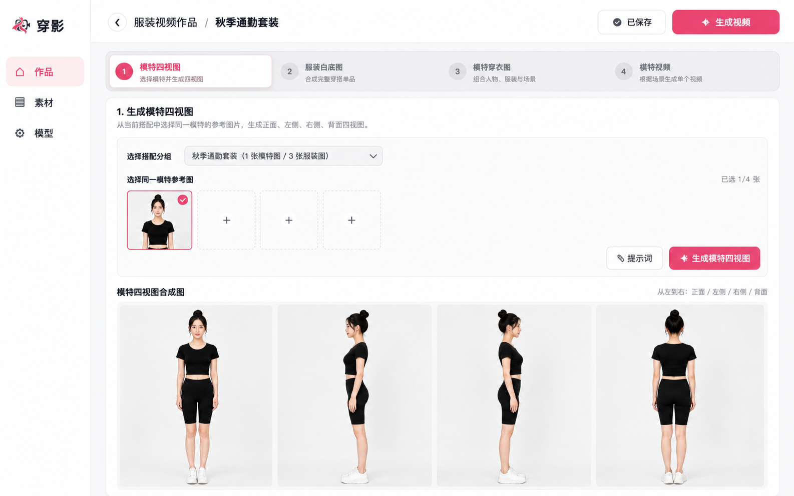
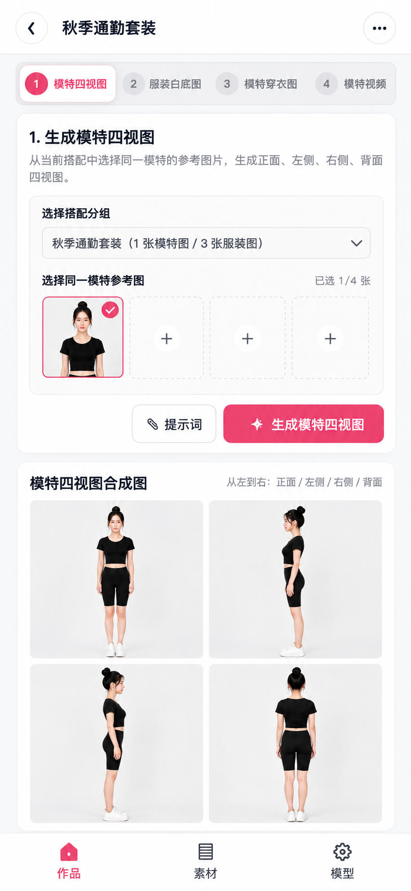

# 穿影｜使用 Codex 从零实现 AI 服装视频工作台

“穿影”是一个本地优先的 AI 服装内容创作工作台，也是一个面向 Codex Vibe Coding 教学的完整实战项目。

用户可以管理模特和服装素材，依次生成模特四视图、服装白底图、场景穿衣图和服装展示短视频。学员则通过需求分析、任务拆分、编码、调试、验收和 Git 提交，学习如何指挥 Codex 从空目录完成一个包含前端、接口、数据库和外部 AI 服务的 Web 应用。

> 本仓库包含参考实现和教学文档。授课时建议让学员从空项目开始，根据文档独立实现，不直接复制成品源码。

## 界面预览

### PC 端



### 手机版



## 核心工作流

1. 创建搭配分组，上传或生成模特与服装素材。
2. 选择同一位模特的参考图，生成正面、左侧、右侧和背面四视图。
3. 选择多件服装素材，生成完整的白底穿搭图。
4. 组合模特、服装和拍摄场景，生成模特穿衣图。
5. 选择穿衣图和视频脚本，提交 Seedance 视频任务。
6. 查询异步任务状态，保存、播放并下载生成视频。

## 功能特性

- 作品创建、编辑、删除和制作进度管理
- 模特与服装搭配分组
- JPG、PNG、WebP 多图片上传
- AI 模特与服装素材生成
- 图片编辑与历史版本管理，原图不会被覆盖
- 模特四视图生成与版本迭代
- 多件服装白底图合成
- 预设或自定义场景穿衣图生成
- Seedance 异步视频提交、轮询、保存与播放
- 多种 AI 能力的地址、模型名称、API Key 和启用状态配置
- SQLite 本地持久化与生成结果归档

## 教学目标

完成本项目后，学员应能够：

- 把产品需求拆成范围明确、可以验收的小任务。
- 让 Codex 先调研仓库和提出方案，再进行代码修改。
- 检查 Codex 的代码差异、运行结果和错误原因。
- 完成前端页面、Route Handler、SQLite 和文件处理的协作开发。
- 接入图片与视频生成服务，处理超时、失败和异步任务。
- 使用 Git checkpoint 保存阶段成果，并完成项目复盘。

推荐开发闭环：

> 理解需求 → 制定计划 → 小步编码 → 浏览器验证 → 修复问题 → 检查差异 → Git 提交 → 阶段复盘

## 教学文档

| 文档 | 用途 |
| --- | --- |
| [需求文档](docs/需求文档.md) | 定义业务范围、功能需求、非功能需求和 MVP 验收标准 |
| [开发路线](docs/开发路线.md) | 按 8 个阶段组织 Codex 实战任务、验收和 Git checkpoint |
| [页面交互说明](docs/页面交互说明.md) | 定义 PC 与手机端页面行为、状态反馈和手工验收流程 |
| [PC 端设计稿](docs/design/穿影-PC端设计稿.png) | PC 工作台的布局与视觉参考 |
| [手机版设计稿](docs/design/穿影-手机版设计稿.png) | 手机端单列布局、步骤导航和底部导航参考 |

## 课程辅助 Skill

仓库提供 [chuanying-backend-next-step](skills/chuanying-backend-next-step/SKILL.md)，用于检查学员当前的业务功能、API 和 SQLite 进度，并给出唯一的下一步任务。该 Skill 不评价 UI、CSS、响应式布局或设计稿还原。

将它复制到 Codex 技能目录后，可以这样调用：

```text
$chuanying-backend-next-step 检查当前功能与数据库进度，告诉我下一步只做什么。
```

默认只进行只读检查。只有明确要求“开始实现下一步”时，Skill 才会进入实施模式。

## 技术栈

- Next.js 14.2
- React 18.3
- Next.js App Router 与 Route Handlers
- Node.js 内置 SQLite（`node:sqlite`）
- ImageMagick
- GPT Image 兼容的文生图与图生图接口
- 多模态模型接口
- Seedance 图生视频接口

## 开发环境

开始前请准备：

- Node.js 22 或更高版本
- npm
- Git
- ImageMagick 7，并确保终端可以执行 `magick`

检查环境：

```bash
node --version
npm --version
git --version
magick -version
```

## 本地启动

```bash
git clone https://gitee.com/alinec/ai-fashion-shot.git
cd ai-fashion-shot
npm install
npm run dev
```

浏览器访问 [http://localhost:3000](http://localhost:3000)。

可用命令：

| 命令 | 作用 |
| --- | --- |
| `npm run dev` | 启动本地开发服务器 |
| `npm run build` | 执行生产构建检查 |
| `npm run start` | 启动已经构建的生产服务 |

## 模型配置

启动应用后进入“模型”页面，分别配置以下能力：

| 模型类型 | 用途 |
| --- | --- |
| 多模态模型 | 图片理解、素材分析与提示词辅助 |
| GPT Image 2 图生图 | 图片编辑、四视图、白底图和穿衣图生成 |
| GPT Image 2 文生图 | 根据文字描述生成模特或服装素材 |
| Seedance 视频模型 | 根据穿衣图生成 5 秒、480p 静音视频 |

每项配置包含启用状态、API 地址、模型名称和 API Key。保存后建议先执行“测试连接”，再进入生成流程。

### 密钥加密

API Key 使用 AES-256-GCM 加密后保存在本地 SQLite 中，不会由配置查询接口返回完整内容。

本地开发时，系统会自动在 `data/.model-config-key` 创建随机加密密钥。需要固定密钥时，可在 `.env.local` 中设置：

```dotenv
MODEL_CONFIG_SECRET=请替换为足够长的随机字符串
```

请勿把真实密钥提交到 Git。已经保存配置后不要随意更换 `MODEL_CONFIG_SECRET`，否则原有加密内容将无法解密。

## 数据与文件

运行时会在项目目录中产生以下内容：

| 路径 | 内容 |
| --- | --- |
| `data/model-config.sqlite` | 作品、素材、图片版本、任务和模型配置 |
| `data/.model-config-key` | 本地生成的模型配置加密密钥 |
| `模特穿搭图/` | 生成的模特穿衣图 |
| `模特视频/` | 下载到本地的视频文件 |

这些路径已加入 `.gitignore`。清理 `data/` 会删除本地作品、素材和配置，请先确认是否需要备份。

## 页面入口

| 路由 | 页面 |
| --- | --- |
| `/` | 默认入口 |
| `/projects` | 作品列表 |
| `/projects/{projectId}` | 作品制作工作台 |
| `/assets` | 素材库 |
| `/model-config` | 模型配置 |

## 项目结构

```text
ai-fashion-shot/
├── app/                  # 页面、样式和服务端接口
├── docs/                 # 教学文档与设计稿
├── lib/                  # SQLite 和模型配置逻辑
├── public/               # 品牌静态资源
├── data/                 # 本地数据库，不提交 Git
├── 模特穿搭图/           # 生成图片，不提交 Git
└── 模特视频/             # 生成视频，不提交 Git
```

## 建议教学阶段

| 阶段 | 核心产出 |
| --- | --- |
| 0. 环境与 Codex 协作 | 可运行的空项目、协作规则和首次提交 |
| 1. 产品骨架 | PC 与手机版静态页面 |
| 2. 作品管理 | 作品增删改查和 SQLite 持久化 |
| 3. 素材库 | 搭配分组、上传和图片版本 |
| 4. 模型配置 | 密钥加密、配置保存和连接测试 |
| 5. AI 图片工作流 | 四视图、白底图和穿衣图 |
| 6. AI 视频工作流 | 异步任务、轮询、保存和播放 |
| 7. 测试与交付 | 构建、安全检查、文档和演示 |

详细任务、提示词示例和验收方法见[开发路线](docs/开发路线.md)。

## 安全说明

- 项目当前面向本地运行，未实现用户登录和多用户隔离。
- 未增加身份验证与访问控制前，请勿直接部署到公网。
- 不要向 Git 提交 API Key、本地数据库、生成素材和构建缓存。
- 服务端应校验上传文件、输入参数、文件名和可配置的远程地址。
- 外部模型请求会产生费用，使用前请确认服务商的计费和数据政策。

## 项目状态

项目目前处于 MVP 和教学实践阶段。核心生成工作流已经具备，PC 与手机版设计稿作为课程的实现目标；生产部署、用户体系、任务队列、对象存储和自动化测试可作为后续扩展。

## 仓库地址

[https://gitee.com/alinec/ai-fashion-shot](https://gitee.com/alinec/ai-fashion-shot)
