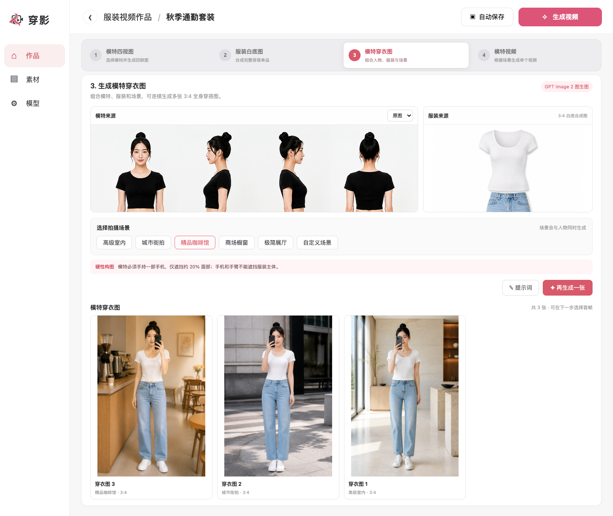
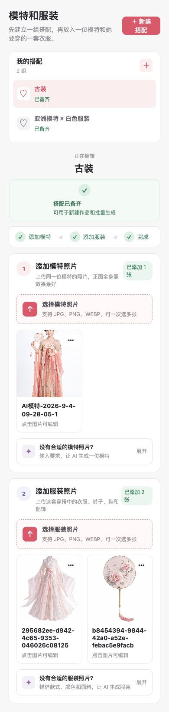

# 穿影｜AI 服装视频工作台

<p align="center">
  
</p>

穿影是一套本地优先的 AI 服装内容生产工作台。它把模特素材、服装素材、图片生成与视频生成组织成一条完整工作流，支持从原始素材一路生成模特四视图、服装白底图、场景穿衣图和服装展示短视频。

项目采用 Next.js 全栈架构，业务数据和模型配置保存在本地 SQLite，生成结果同步归档到本地目录，适合用于 AI 服装内容工作流验证、二次开发和 Codex Vibe Coding 实践。

## 项目预览

### PC 端



### 手机端



项目的 8 个业务模块均提供 PC 与手机端真实运行截图，详见 [完整 UI 设计稿](docs/design/README.md)。

## 核心工作流

```text
创建作品
   ↓
建立搭配分组，上传或生成模特与服装素材
   ↓
生成模特正面、左侧、右侧、背面四视图
   ↓
将多件服装合成为 3:4 白底穿搭图
   ↓
组合模特、服装和拍摄场景，生成模特穿衣图
   ↓
选择穿衣图和分镜脚本，生成服装展示短视频
   ↓
保存、播放和下载生成结果
```

## 功能模块

| 模块 | 主要能力 |
| --- | --- |
| 作品管理 | 创建、编辑、删除作品，查看制作阶段与更新时间 |
| 素材与搭配 | 创建搭配分组，上传模特和服装图片，维护素材归属关系 |
| 图片编辑与版本 | 使用文字要求编辑图片，保留原图和历史版本 |
| 模特四视图 | 根据模特参考图生成正面、左侧、右侧和背面视图 |
| 服装白底图 | 选择多件服装素材，生成 3:4 白底完整穿搭图 |
| 模特穿衣图 | 组合模特、服装与拍摄场景，生成场景化穿搭图片 |
| 模特视频 | 提交异步视频任务，查询状态，保存、播放和下载视频 |
| 模型配置 | 管理多模态、文生图、图生图和视频模型的连接配置 |

## 功能特点

- 作品、素材、图片版本和生成任务全流程持久化
- JPG、PNG、WebP 多图片上传
- 文字生成模特或服装素材
- AI 图片编辑与非覆盖式版本管理
- 四视图、白底图、穿衣图逐阶段生成
- 预设场景与自定义场景支持
- Seedance 异步视频提交、状态轮询和本地保存
- API 地址、模型名称、API Key 与启用状态可视化配置
- API Key 使用 AES-256-GCM 加密保存
- AI 请求、响应摘要、生成文件和校验信息本地归档
- PC 与手机端真实界面参考

## 技术栈

| 分类 | 技术 |
| --- | --- |
| Web 框架 | Next.js 14.2、React 18.3、App Router |
| 服务端接口 | Next.js Route Handlers |
| 数据存储 | Node.js 内置 SQLite（`node:sqlite`） |
| 图片处理 | ImageMagick 7 |
| 图片生成 | GPT Image 兼容的文生图与图生图接口 |
| 图片理解 | OpenAI 兼容的多模态接口 |
| 视频生成 | Seedance 图生视频接口 |
| 密钥保护 | AES-256-GCM |

## 快速开始

### 环境要求

- Node.js 22 或更高版本
- npm
- Git
- ImageMagick 7，终端中可以执行 `magick`

检查本地环境：

```bash
node --version
npm --version
git --version
magick -version
```

### 获取并启动项目

GitHub：

```bash
git clone https://github.com/laohan-repos/ai-fashion-shot.git
cd ai-fashion-shot
npm install
npm run dev
```

也可以从码云获取：

```bash
git clone https://gitee.com/alinec/ai-fashion-shot.git
cd ai-fashion-shot
npm install
npm run dev
```

启动后访问 [http://localhost:3000](http://localhost:3000)。

### 常用命令

| 命令 | 说明 |
| --- | --- |
| `npm run dev` | 启动开发服务器 |
| `npm run build` | 执行生产构建 |
| `npm run start` | 启动已构建的生产服务 |

## 模型配置

首次使用前，进入 `/model-config` 配置所需模型服务：

| 模型类型 | 用途 |
| --- | --- |
| 多模态模型 | 识别服装、分析模特图片和辅助生成提示词 |
| GPT Image 2 图生图 | 图片编辑、四视图、白底图和穿衣图生成 |
| GPT Image 2 文生图 | 根据文字描述生成模特或服装素材 |
| Seedance 视频模型 | 根据穿衣图生成 5 秒、480p、静音视频 |

每项配置包含启用状态、API 地址、模型名称和 API Key。保存后可先执行“测试连接”，确认服务可用后再进入生成流程。

### API Key 安全

API Key 使用 AES-256-GCM 加密后存入本地 SQLite，配置查询接口不会返回完整密钥。

开发环境会自动创建 `data/.model-config-key` 作为本地加密密钥。需要使用固定密钥时，可在 `.env.local` 中设置：

```dotenv
MODEL_CONFIG_SECRET=请替换为足够长的随机字符串
```

不要将真实 API Key、`.env.local` 或本地密钥提交到 Git。已经保存模型配置后不要随意更换 `MODEL_CONFIG_SECRET`，否则已有密文将无法解密。

## 页面入口

| 路由 | 页面 |
| --- | --- |
| `/` | 默认入口 |
| `/projects` | 作品管理 |
| `/projects/{projectId}` | 四阶段作品制作工作台 |
| `/assets` | 素材与搭配管理 |
| `/model-config` | AI 模型配置 |

## 数据与生成文件

项目运行时会创建以下本地内容：

| 路径 | 内容 |
| --- | --- |
| `data/model-config.sqlite` | 作品、素材、图片版本、生成任务与模型配置 |
| `data/.model-config-key` | 自动生成的本地加密密钥 |
| `data/gpt-image2-results/` | 图片生成请求、响应和结果归档 |
| `data/seedance-results/` | 视频任务请求、响应和元数据归档 |
| `模特穿搭图/` | 最终穿衣图文件 |
| `模特视频/` | 已下载的视频文件 |

这些目录均已加入 `.gitignore`。删除 `data/` 会同时删除本地业务数据与模型配置，操作前请先备份。

## 项目结构

```text
ai-fashion-shot/
├── app/
│   ├── api/                         # 作品、素材、图片和视频接口
│   ├── assets/                      # 素材与搭配页面
│   ├── model-config/                # 模型配置页面
│   └── projects/                    # 作品列表与四阶段工作台
├── docs/
│   ├── design/                      # 8 个模块的真实 UI 截图
│   └── 需求文档.md                  # 完整产品需求
├── lib/                             # SQLite、数据访问和密钥加密
├── public/                          # Logo 等静态资源
├── skills/                          # 项目配套 Codex Skill
├── data/                            # 运行时数据库与生成归档，不提交 Git
├── 模特穿搭图/                      # 生成图片，不提交 Git
└── 模特视频/                        # 生成视频，不提交 Git
```

## 项目文档

| 文档 | 内容 |
| --- | --- |
| [需求文档](docs/需求文档.md) | 项目范围、8 个模块、数据要求和 MVP 验收标准 |
| [真实 UI 设计稿](docs/design/README.md) | 全部模块的 PC 与手机端真实运行界面 |
| [下一步开发 Skill](skills/chuanying-backend-next-step/SKILL.md) | 检查业务功能、API 和 SQLite 进度，给出唯一下一步任务 |

调用仓库内的 Skill 时，可以使用：

```text
$chuanying-backend-next-step 检查当前功能与数据库进度，告诉我下一步只做什么。
```

## 当前边界

当前版本定位为本地运行的 MVP：

- 尚未提供用户登录、团队协作和多租户数据隔离
- 尚未接入任务队列、对象存储和分布式部署
- 尚未建立完整的自动化测试体系
- 未增加身份认证和访问控制前，不建议直接部署到公网
- 调用外部 AI 服务可能产生费用，请提前确认服务商的计费与数据政策

## 仓库地址

- GitHub：[laohan-repos/ai-fashion-shot](https://github.com/laohan-repos/ai-fashion-shot)
- 码云：[alinec/ai-fashion-shot](https://gitee.com/alinec/ai-fashion-shot)
