# 穿影真实 UI 设计稿

本目录中的设计稿全部截取自当前项目的真实运行页面，不是 AI 生成的概念图。截图使用项目现有数据，覆盖作品、素材、图片编辑、四步生成工作台和模型配置等完整 UI。

- PC 基准视口：1440 × 900
- 手机基准视口：390 × 844
- 截图日期：2026-09-26
- 手机端工作台存在约 614px 的页面最小宽度，完整页面截图会展示真实的横向溢出范围；这属于当前实现状态，不对截图做人工压缩或重排。

## 01. 作品管理

### PC 端

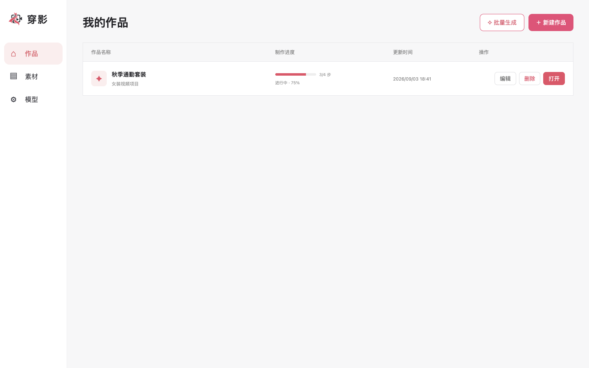

### 手机端

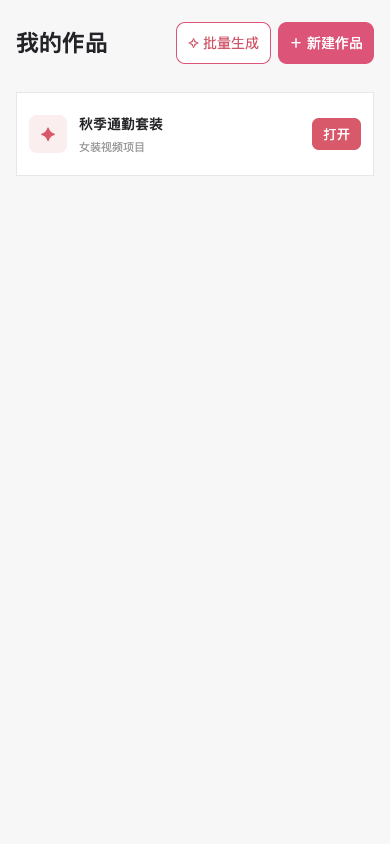

## 02. 素材与搭配

### PC 端

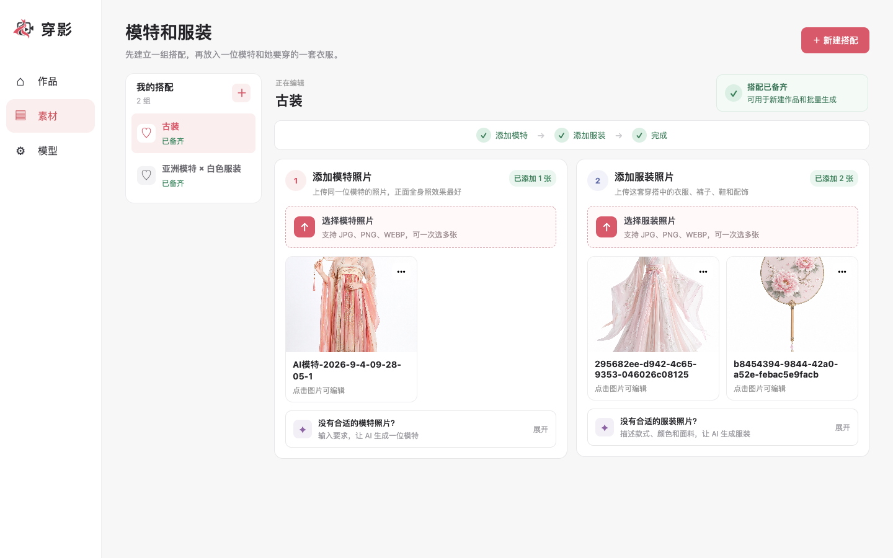

### 手机端

## 03. 图片编辑与版本

图片编辑弹窗包含编辑要求、历史版本、生成操作和原图保护等界面。

### PC 端

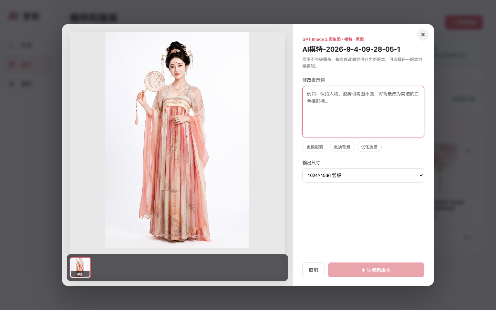

### 手机端

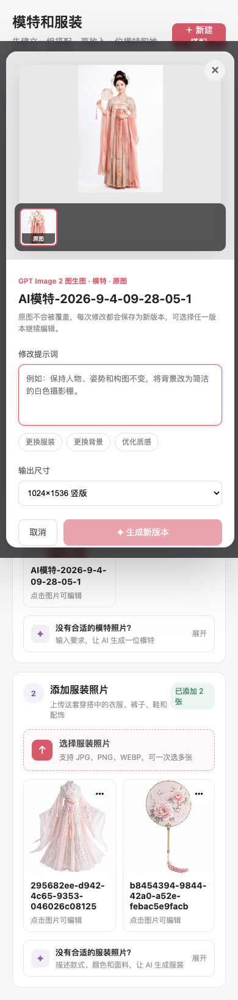

## 04. 模特四视图

### PC 端

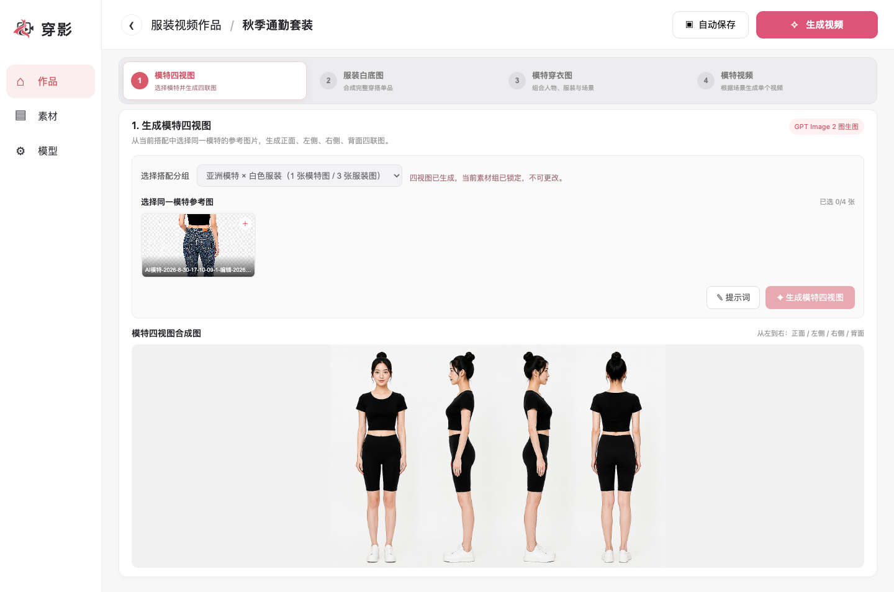

### 手机端

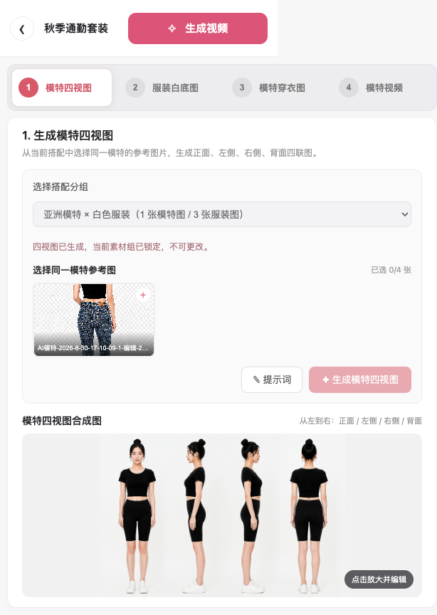

## 05. 服装白底图

### PC 端

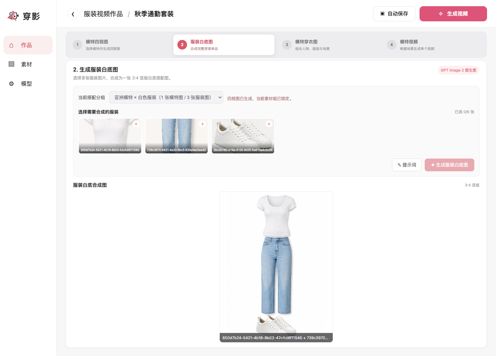

### 手机端

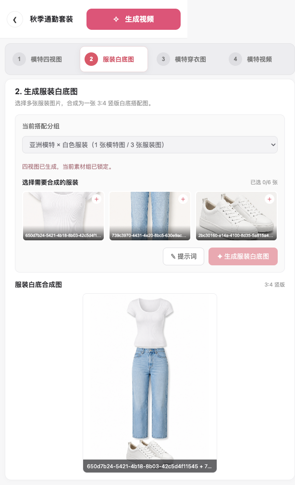

## 06. 模特穿衣图

### PC 端

### 手机端

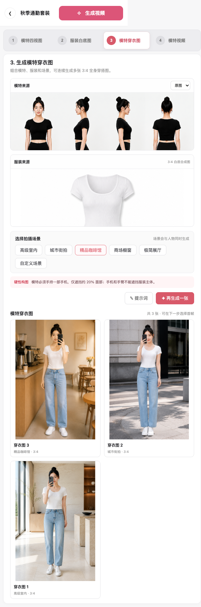

## 07. 模特视频

### PC 端

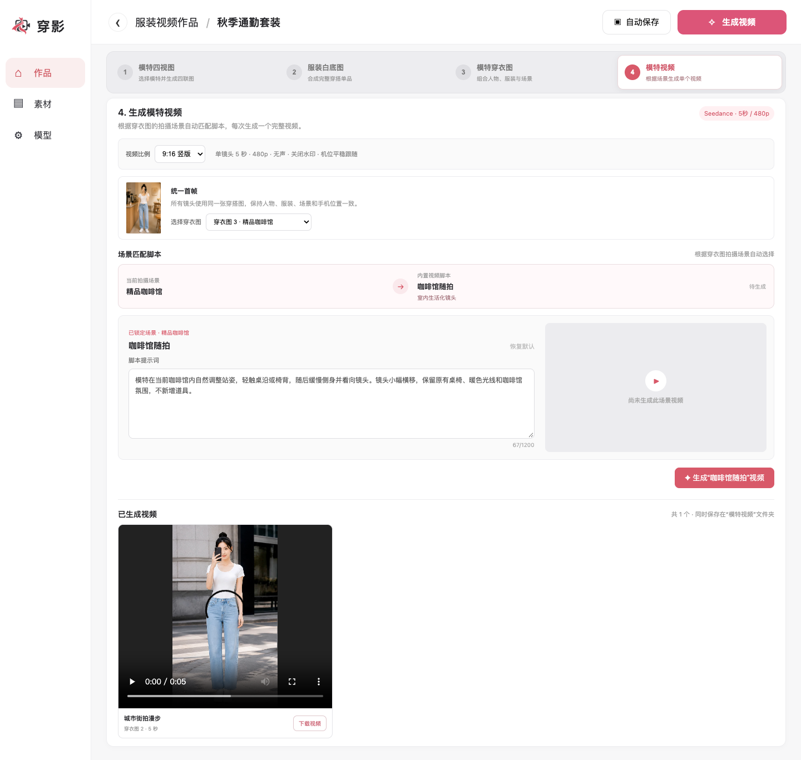

### 手机端

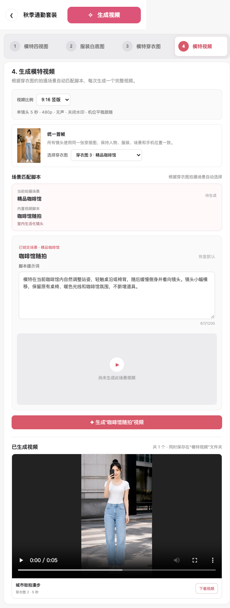

## 08. 模型配置

API Key 在截图中保持隐藏，只展示项目真实的配置表单与服务状态。

### PC 端

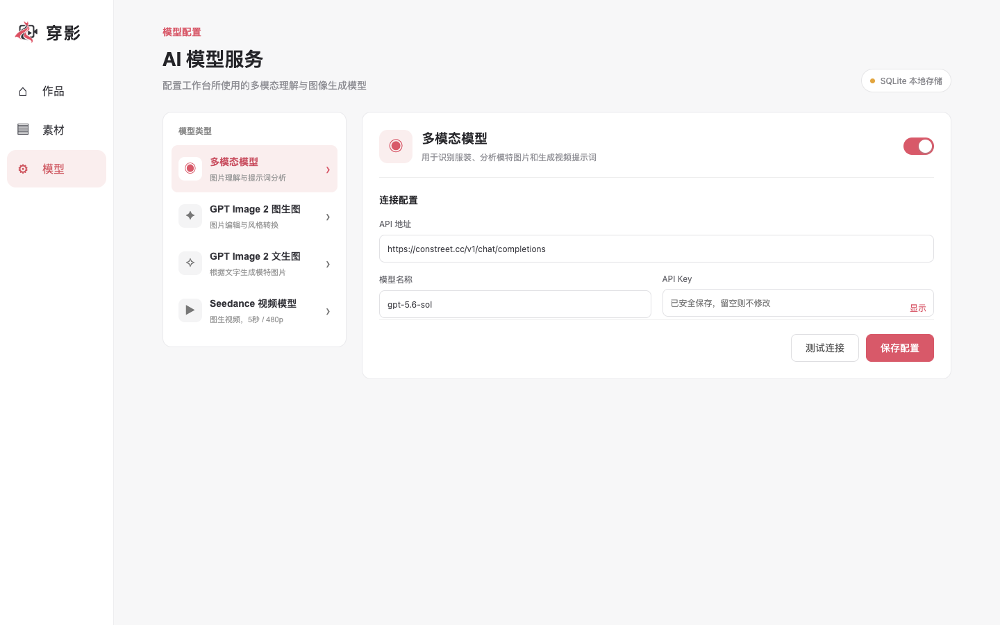

### 手机端

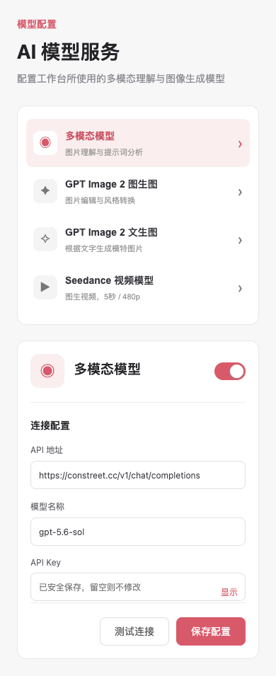
